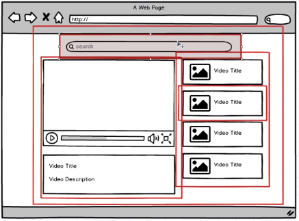

Modern React with Redux
---------------------------

https://www.udemy.com/react-redux/learn/v4/t/lecture/4224604?start=0

https://github.com/StephenGrider/ReduxCasts


```
js files + react + redux
|
Webpack + Babel
|
JSX + ES6 -> ES5
|
html, js, css
| 
browser;
```

### Hello World (React and ReactDOM)

seperate into 2 libs
- import React from 'react';
- import ReactDOM from 'react-dom';

#### 1. Create a new component. This component should produce some HTML

App is a function (component class) not a instance
```js
const App = function() {
  return <div>Hi</div>;
} 
// ES6
const App = () => {
  return <div>Hi</div>;
}
```

Babel will transform it to vanilla js
```js
var App = function App() {
  return React.createElement(
    "div",
    null,
    "Hi"
  );  
};
```

`<App />` or `<App> </App>` -> `React.createElement(App, null);`

#### 2. Take this component's generated HTML and put it on the page (in the DOM)
needs 2 params: 
- component instance: the generated html
- a DOM element: whare to render to
- `ReactDOM.render(<App/>, document.querySelector('.container'));`

### Component Structure
- bottom up: details -> one big container
- nested: item as a component, list as another one
- reuse component
- always one component per file



### Export Component
- component can be nested
- a outer-most component import children component
- outer component: `import`
- inner component: `export`

```js
export default SearchBar;
export {SearchBar}
```

Default exports
- `export default`
- to export a single value

Named exports
- `export { SearchBar }`
- `export const foo = Math.sqrt(2);`


### Import Component
- import our files `import SearchBar from './search_bar';`
- import libary `import react from 'react'`
- `import React, { Component } from 'react';` same as `const Component = React.Component`


### Component
- always start with functional component, refactory it when needed

functional component
```js
const SearchBar = () => {
  return <input /> // React.createElement still need 'react'
};
export default SearchBar;
```

class-based component
```js
class SearchBar extends React.Component {
  render() {
    return (
      <input type="text"/>
    )
  }
}
export default SearchBar;
```

### Event Handler

```js
render() {
  return (
    <input type="text" onChange={this.onInputChange}/>
  );
}

onInputChange(event) {
  console.log(event.target.value);
}

// or in ES6
render() {
  return (
    <input type="text" onChange={(event => console.log(event.target.value))}/>
  );
}
```

### State

- each *class-based* component has its own state, a plain JS object
- initialize in constructor `this.state = { bala }` 
- any state change trigger itself and its descendant render

#### Manipulate state

control -> state
- DOM callback -> this.setState
- `<input type="text" onChange={event => this.setState({ term: event.target.value })}/>`
- `this.setState({ bala })` to inform react state is changing

state -> control
- this.state -> control value/
- `<input value={this.state.term} />`


> use `{}` to wrap js in jsx